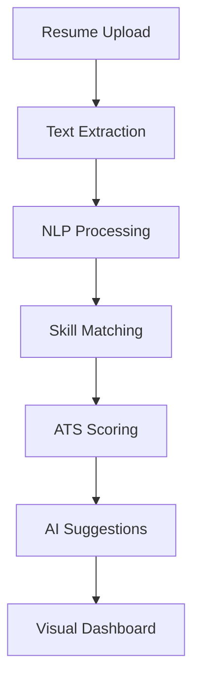

# 💼 AI Resume Analyzer


An intelligent resume analysis tool that evaluates your resume against target job roles and provides AI-powered career guidance.

## Table of Contents
- [Project Overview](#project-overview)
- [Key Features](#key-features)
- [Tech Stack](#tech-stack)
- [Data Flow](#data-flow)
- [Installation](#installation)
- [Usage](#usage)
- [Results Interpretation](#results-interpretation)
- [Future Work](#future-work)

## Project Overview
This AI-powered application analyzes resumes against 11 different job roles, providing:
- ATS compatibility scoring
- Skill gap analysis
- Personalized learning recommendations
- Resume content extraction from multiple formats

## Key Features

### 📄 Multi-Format Resume Processing
- Supports PDF, DOCX, and image files (PNG/JPG)
- OCR capabilities for scanned documents
- Text extraction and NLP preprocessing

### 🔍 Job Role Analysis
- 11 predefined job roles with skill requirements
- Required vs optional skill categorization
- Real-time ATS score calculation

### 🤖 AI-Powered Guidance
- Hugging Face API integration for suggestions
- Practical learning resource recommendations
- Emoji-enhanced actionable advice

## Tech Stack
| Component | Technology |
|-----------|------------|
| Web Framework | Streamlit |
| NLP Processing | Spacy, NLTK |
| Document Parsing | pdfplumber, python-docx |
| OCR | Tesseract (pytesseract) |
| AI Suggestions | Hugging Face Inference API |
| Visualization | Streamlit Components |

## Data Flow


## Installation

### Prerequisites
- Python 3.8+
- Tesseract OCR installed on your system
- Hugging Face API token (free tier available)

1. Clone the repository:
```bash
git clone https://github.com/your-username/resume-analyzer.git
cd resume-analyzer
```

2. Install dependencies:
```bash
pip install -r requirements.txt
```

3. Set up environment variables:
```bash
echo "HF_TOKEN=your_huggingface_token" > .env
```

4. Download NLTK data and Spacy model:
```python
python -m nltk.downloader punkt stopwords
python -m spacy download en_core_web_sm
```

## Usage
Run the Streamlit application:
```bash
streamlit run app.py
```

The application will open in your default browser at `http://localhost:8501`

### How to Use:
1. Upload your resume (PDF/DOCX/Image)
2. Select target job role from dropdown
3. Click "Analyze Resume"
4. View your ATS score and skill matches
5. Explore AI suggestions for missing skills

## Results Interpretation
### Score Breakdown
| Score Range | Interpretation |
|-------------|----------------|
| 85-100 | Excellent match |
| 70-84 | Strong candidate |
| 50-69 | Needs improvement |
| <50 | Significant skill gaps |

### Output Sections:
- **ATS Score**: Overall compatibility percentage
- **Matching Skills**: Found in your resume
- **Missing Skills**: Required for the role
- **AI Suggestions**: Custom learning roadmap

## Future Work
- [ ] Add multi-page resume support
- [ ] Implement LinkedIn profile integration
- [ ] Include salary range estimates
- [ ] Add cover letter generator
- [ ] Expand to international job markets

